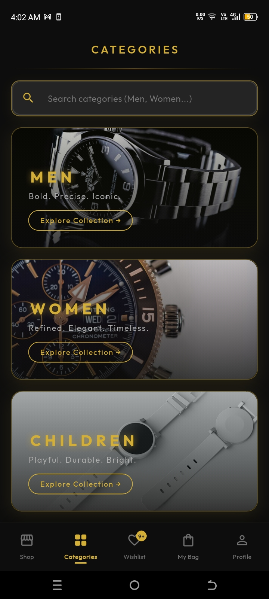
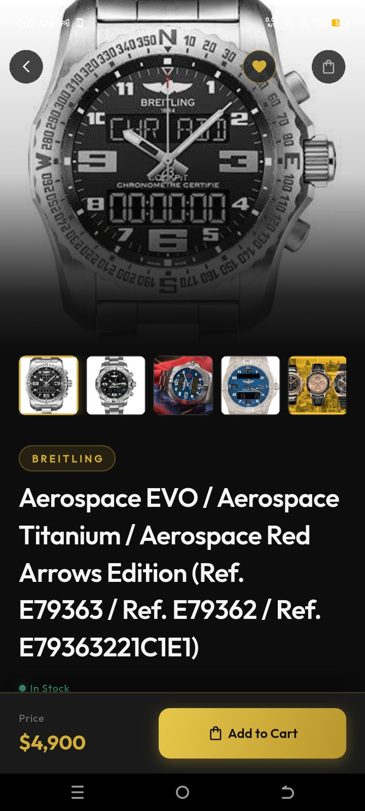
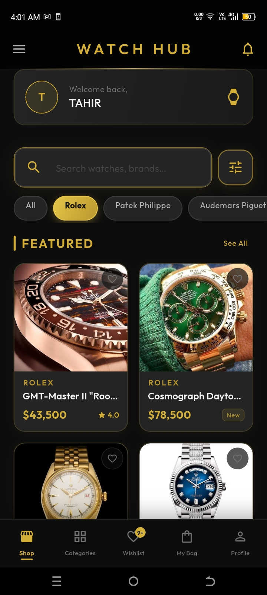
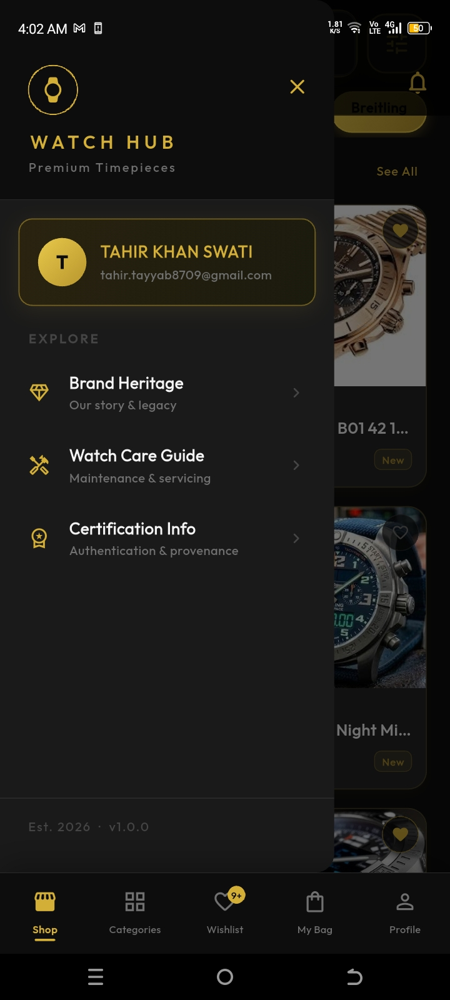

# WatchHub

An e-commerce watch shopping app with product browsing, cart, and order management.

**Tech stack:** Flutter, Firebase, Riverpod

## Features
- Product browsing and search
- Cart and checkout
- Order management
- Firebase authentication

## Screenshots

  
  
  
  

---
Built by [Tahir Khan](https://github.com/tahirkhan8709)
